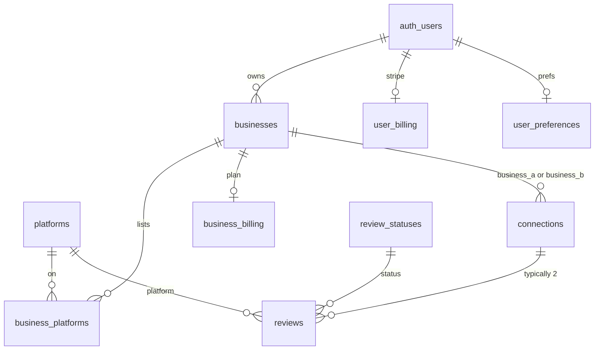

# Database schema design

This document describes the **PostgreSQL schema** used by R4R: tables, relationships, invariants, and how application code interprets the data. Use it for schema review and onboarding.

For **connection matching and slot behavior** (user flows, server actions), see [connections.md](./connections.md). For applying SQL to a Supabase project, see [supabase-and-local-development.md](./supabase-and-local-development.md).

---

## Source of truth and bootstrap

| Artifact | Role |
|----------|------|
| [`schema.sql`](../schema.sql) | **Canonical full snapshot** for fresh environments (schema + security model expected by app). |
| [`supabase/migrations/`](../supabase/migrations/) | **History/audit trail** of incremental evolution; keep synchronized with snapshot changes. |
| [`types/database.ts`](../types/database.ts) | TypeScript types for the app; regenerate when the live schema changes. |

**New project checklist**

1. Run [`schema.sql`](../schema.sql) once (SQL Editor or scripted apply).
2. Seed demo/test users if needed.

> **Maintainer note:** migrations are preserved for history and rollout traceability. For every DB change PR, update both migration SQL and `schema.sql` snapshot in the same PR to avoid drift.

---

## Design principles

1. **Business-centric** — Matching, slots, and connection-backed reviews anchor on `businesses`. Users (`auth.users`) own one or more businesses.
2. **Canonical connection pairs** — `business_a_id < business_b_id` so (A,B) and (B,A) are one row. App code uses the same ordering (`canonicalPair` in `connection-actions.ts`).
3. **Connection-backed reviews** — Each match creates two `reviews` rows with `connection_id` set. Slot source of truth is outgoing `reviews` in `DRAFT`; hot reads use `business_billing.slots_used`.
4. **Lookup tables, not Postgres enums** — `review_statuses` uses integer FKs; names are fixed in app code (`ReviewStatusNames` in `constants/shared.ts`).
5. **Rules split: SQL vs app** — Core invariants are partially in SQL (unique leg per business per connection); server actions enforce one active pair per business pair, slot limits, etc.
6. **Owner-scoped RLS** — Core business/review/connection tables and billing/preferences are protected by ownership/role policies; privileged flows use service-role server paths.

---

## Entity relationship overview

---

## Tables

### `platforms`

Review site catalog (seeded).

| Column | Type | Notes |
|--------|------|--------|
| `id` | serial | PK |
| `name` | text | e.g. Yelp, Google, TripAdvisor |
| `color` | text | Tailwind classes for UI |
| `created_at`, `updated_at` | timestamptz | `updated_at` trigger |

**Seed data:** Yelp, Google, TripAdvisor (`schema.sql`).

---

### `businesses`

A location/profile owned by one user.

| Column | Type | Notes |
|--------|------|--------|
| `id` | serial | PK |
| `user_id` | uuid | FK → `auth.users`, ON DELETE CASCADE |
| `business_name` | text | |
| `phone` | text | nullable |
| `address`, `city`, `state`, `zip_code` | text | `state` used for MVP same-state matching |
| `cover_image_url` | text | nullable; migration `20260411120000` |
| `created_at`, `updated_at` | timestamptz | `updated_at` trigger |

**RLS:** owner CRUD (`user_id = auth.uid()`) plus scoped read access when row appears in the caller's related connection/review context.

---

### `business_platforms`

Links a business to a platform URL (at most one row per business + platform).

| Column | Type | Notes |
|--------|------|--------|
| `id` | serial | PK |
| `business_id` | int | FK → `businesses` |
| `platform_id` | int | FK → `platforms` |
| `platform_url` | text | nullable |
| `platform_business_id` | text | nullable |
| `is_verified` | boolean | default false |
| `created_at`, `updated_at` | timestamptz | |

**Constraint:** `UNIQUE (business_id, platform_id)`.

**RLS:** row access is allowed only through owned `business_id`.

**Matching:** `startConnectionMatch` uses the **first** platform row per business (`limit 1`). Product may later want one review leg per platform.

---

### `review_statuses`

Small lookup table; names must match app enums.

| Names (seeded) |
|----------------|
| `DRAFT`, `SUBMITTED`, `VERIFIED`, `REJECTED` |

App: `ReviewStatusNames` in `constants/shared.ts`.

---

### `connections`

Pairing between two businesses for review exchange. Pair is lifetime-unique and lifecycle state is tracked by timestamps.

| Column | Type | Notes |
|--------|------|--------|
| `id` | serial | PK |
| `business_a_id`, `business_b_id` | int | FK → `businesses`; **CHECK** `business_a_id < business_b_id` |
| `initiator_business_id` | int | FK → `businesses`; who started the match |
| `created_at` | timestamptz | |
| `closed_at` | timestamptz | nullable; both reviews submitted (non-DRAFT) |
| `resolved_at` | timestamptz | nullable; both reviews terminal (`VERIFIED`/`REJECTED`) |
**Constraints / indexes:** `UNIQUE (business_a_id, business_b_id)`.

**App-enforced (not in SQL):**

- At most one row per unordered pair (`hasConnectionBetween` + SQL unique constraint).
- Exactly two reviews per connection in normal match flow.

**Lifecycle timestamps:**

1. Both linked reviews become non-`DRAFT` → `closed_at`.
2. Both linked reviews become terminal (`VERIFIED`/`REJECTED`) → `resolved_at`.

**RLS:** accessible only when the auth user owns one participant business (insert is constrained to owned initiator business).

See [connections.md](./connections.md) for narrative and code pointers.

---

### `reviews`

Connection-backed review leg: one party’s obligation to review the other’s business on a platform.

| Column | Type | Notes |
|--------|------|--------|
| `id` | serial | PK |
| `connection_id` | int | FK → `connections`, NOT NULL |
| `platform_id` | int | FK → `platforms` |
| `reviewed_business_id` | int | FK → `businesses`; business receiving the review |
| `reviewed_owner_user_id` | uuid | FK → `auth.users`; owner of reviewed business |
| `reviewer_user_id` | uuid | FK → `auth.users`; user who writes/submits |
| `reviewer_business_id` | int | nullable; FK → `businesses`; reviewer’s business context (slots, dashboard) |
| `content`, `url` | text | nullable |
| `status_id` | int | FK → `review_statuses` |
| `rejection_reason` | text | nullable |
| `submitted_at`, `verified_at` | timestamptz | nullable |
| `created_at`, `updated_at` | timestamptz | |

**Constraints:** `UNIQUE (connection_id, reviewed_business_id)`; `CHECK (reviewed_business_id <> reviewer_business_id)`.

**Indexes:** `connection_id`, `reviewer_user_id`, `reviewed_owner_user_id`, partial on `reviewer_business_id`.

**RLS:** read/write is role-scoped (reviewer or reviewed owner), with initiator-scoped insert/delete for connection bootstrap/rollback.

**Connection match bundle** (`startConnectionMatch`):

1. Insert `connections` (active).
2. Insert two `reviews` (`DRAFT`), opposite directions, each with full context columns.

---

### `user_billing`

Stripe customer and parent subscription per user (written by webhooks / service role).

| Column | Type | Notes |
|--------|------|--------|
| `user_id` | uuid | PK, FK → `auth.users` |
| `stripe_customer_id` | text | |
| `stripe_subscription_id` | text | nullable |
| `subscription_current_period_end` | timestamptz | nullable |
| `updated_at` | timestamptz | |

**RLS:** authenticated SELECT where `auth.uid() = user_id`.

---

### `business_billing`

Per-business plan and slot accounting cache.

| Column | Type | Notes |
|--------|------|--------|
| `business_id` | bigint | PK, FK → `businesses` |
| `tier` | smallint | 0–2 (Starter, Velocity, Momentum) |
| `slot_limit` | int | default 1; CHECK `> 0` |
| `slots_used` | int | default 0; denormalized count of outgoing DRAFT reviews |
| `stripe_subscription_item_id` | text | nullable |
| `current_period_end` | timestamptz | nullable |
| `cancel_at_period_end` | boolean | default false |
| `updated_at` | timestamptz | |

**Missing row** → treated as Starter (tier 0, 1 slot) in `lib/billing/check-slots.ts`.

**Default slot limits (app):** Starter 1, Velocity 5, Momentum 15 (`lib/billing/tiers.ts`).

**RLS:** authenticated SELECT for businesses owned by `auth.uid()`.

---

### `user_preferences`

Notification toggles (migration `20260411130000`).

| Column | Type | Notes |
|--------|------|--------|
| `user_id` | uuid | PK, FK → `auth.users` |
| `notify_new_connection` | boolean | default true |
| `notify_weekly_summary` | boolean | default false |
| `updated_at` | timestamptz | |

**RLS:** full SELECT/INSERT/UPDATE for own `user_id`.

---

## Slot accounting

A business **uses** a slot when:

- It has an outgoing review row in `reviews` where:
  - `reviewer_business_id = <business id>`, and
  - status is `DRAFT`.

`business_billing.slots_used` is the hot read path; `reviews` remains canonical for fallback/reconcile.

Implementation:
- Reads: `getSlotsUsed` / `countSlotsUsedForBusiness` in `lib/billing/check-slots.ts` + `lib/billing/slots-used.ts`.
- Writes: `startConnectionMatch` (+1 for both businesses), `submitOutgoingReview` (-1 for reviewer business).
- Safety: reconciliation helper recomputes from `reviews`.

---

## Storage (Supabase)

Defined in migrations, not `schema.sql`.

| Bucket | Purpose | Policies |
|--------|---------|----------|
| `business-photos` | Cover images | Public read; authenticated write under `{auth.uid()}/` |
| `user-avatars` | Profile avatars | Same pattern |

`businesses.cover_image_url` stores the public URL.

---

## Functions

### `delete_user_account_data(target_user_id uuid)`

`SECURITY DEFINER`; granted to `service_role` only. Deletes reviews (by reviewer, reviewed owner, or owned business), connections, business_platforms, businesses, and user_preferences for that user’s graph. Used before `auth.admin.deleteUser`.

Defined in migration `20260411130000_user_preferences_and_account.sql`.

---

## Migration history

| File | Adds |
|------|------|
| `20260411120000_business_cover_image.sql` | `businesses.cover_image_url`, `business-photos` bucket + policies |
| `20260411130000_user_preferences_and_account.sql` | `user_preferences`, `user-avatars` bucket, `delete_user_account_data` |
| `20260411140000_billing.sql` | `user_billing`, `business_billing`, RLS |
| `20260411150000_review_invitations_invitee_business.sql` | `review_invitations.invitee_business_id` |
| `20260411160000_connections.sql` | `connections` table, `review_invitations.connection_id` |
| `20260411170000_connection_partner_ack.sql` | `partner_acknowledged_at`, index |
| `20260411190000_connection_per_business_slot_release.sql` | `business_a_slot_released_at`, `business_b_slot_released_at` |
| `20260526100000_merge_invitations_into_reviews.sql` | Merge `review_invitations` into `reviews`; drop `invitation_statuses` |
| `20260527100000_connection_lifecycle_refactor.sql` | `connections.closed_at/resolved_at`, pair UNIQUE, `business_billing.slots_used`, drop legacy connection status/release columns |
| `20260531150000_core_rls_and_realtime_notifications.sql` | Enable RLS for core tables/policies; drop `connections.partner_acknowledged_at` |

---

## Security model (summary)

| Area | Mechanism |
|------|-----------|
| Preferences, billing, core tables | Postgres RLS (owner/role scoped) |
| Storage objects | Bucket policies on `storage.objects` |
| Privileged mutations (matching bootstrap, billing sync, admin-like operations) | Service role server paths |
| Stripe / account delete | Service role, webhooks |

---

## Review checklist

Use this when changing schema or reviewing for production:

- [ ] Baseline + migrations applied in order on fresh DB
- [ ] `types/database.ts` updated to match
- [ ] Lookup seed names unchanged or app constants updated
- [ ] Slot logic still correct if `connections` or release columns change
- [ ] `delete_user_account_data` order updated if new FKs from user-owned data
- [ ] Consider DB constraints for: unique active pair per business pair
- [ ] Core-table RLS policies validated for owner and non-owner behavior

---

## Related code

| Topic | Location |
|-------|----------|
| Match + create connection bundle | `app/(protected)/(workspace)/business/[id]/connection-actions.ts` |
| Complete connection / slot release | `lib/connections/complete-connection.ts` |
| Slot limits and counts | `lib/billing/check-slots.ts`, `lib/billing/tiers.ts` |
| Domain narrative | [connections.md](./connections.md) |
| Apply to Supabase | [supabase-and-local-development.md](./supabase-and-local-development.md) |
